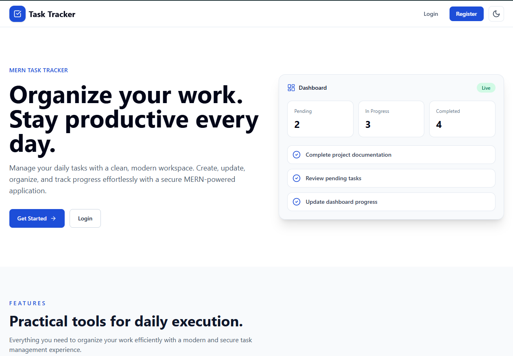
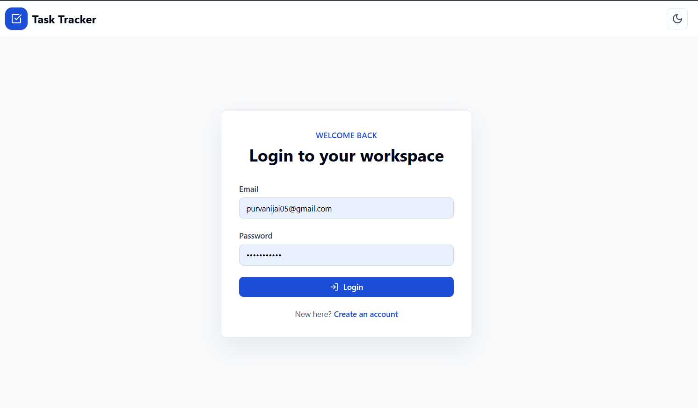
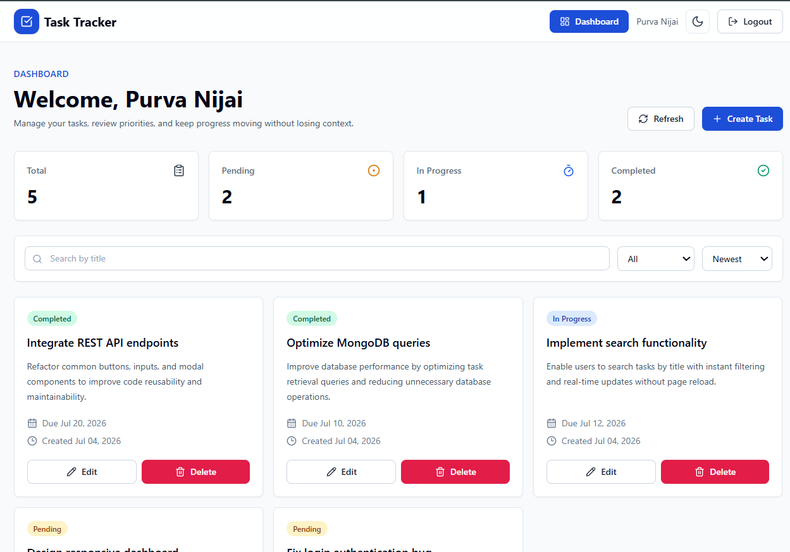

<p align="center">
  
</p>

<h1 align="center">Task Tracker</h1>

<p align="center">
Modern MERN Stack Task Management Application
</p>

<p align="center">
Secure • Responsive • JWT Authentication • CRUD • Dark Mode
</p>

---

A modern, secure, and responsive **MERN Stack Task Tracker** application built using **MongoDB, Express.js, React.js, and Node.js**.

The application enables users to securely manage daily tasks with **JWT Cookie Authentication**, complete **CRUD operations**, **search**, **filter**, **sorting**, **dark/light theme**, and a fully responsive user interface.

# 🌐 Live Demo

| Service | URL |
|---------|-----|
| Frontend | https://task-tracker-a6z22ip6u-nijaipurva123-2427s-projects.vercel.app |
| Backend API | https://task-tracker-vd2e.onrender.com |

---

# 📑 Table of Contents

- [✨ Features](#-features)
- [🛠 Tech Stack](#-tech-stack)
- [📂 Folder Structure](#-folder-structure)
- [⚙️ Environment Variables](#️-environment-variables)
- [📦 Installation](#-installation)
- [🚀 Running the Project](#-running-the-project)
- [🔐 Authentication Flow](#-authentication-flow)
- [📡 API Endpoints](#-api-endpoints)
- [🖥 Application Screens](#-application-screens)
- [🌟 Future Improvements](#-future-improvements)
- [👩‍💻 Author](#-author)
- [📄 License](#-license)

---

# ✨ Features

## 🔐 Authentication

- User Registration
- User Login
- Secure JWT Authentication
- HttpOnly Cookie Authentication
- Protected Routes
- Current Logged-in User
- Logout Functionality

---

## ✅ Task Management

- Create Task
- View Tasks
- Update Task
- Delete Task
- Due Date Support
- Task Status Management

---

## 🔍 Search, Filter & Sort

- Search by Task Title
- Filter by Status
- Sort by
  - Newest
  - Oldest
  - Due Date

---

## 🎨 User Interface

- Responsive Design
- Dark Mode
- Light Mode
- Toast Notifications
- Loading States
- Empty State Components
- Reusable Components
- Mobile Friendly

---

## 🛡 Security

- JWT Authentication
- HttpOnly Cookies
- Helmet Security
- Express Validator
- Protected APIs
- Input Validation

---

# 🛠 Tech Stack

## Frontend

- React.js
- React Router DOM
- React Hook Form
- Axios
- Tailwind CSS
- Lucide React
- React Hot Toast

---

## Backend

- Node.js
- Express.js
- MongoDB
- Mongoose
- JWT
- Cookie Parser
- Express Validator
- Helmet
- Morgan
- CORS

---

# 📂 Folder Structure

```
task-tracker
│
├── client
│   ├── public
│   │
│   ├── src
│   │   ├── api
│   │   ├── assets
│   │   ├── components
│   │   │   ├── auth
│   │   │   ├── common
│   │   │   ├── home
│   │   │   ├── layout
│   │   │   └── task
│   │   │
│   │   ├── context
│   │   ├── hooks
│   │   ├── pages
│   │   ├── routes
│   │   ├── utils
│   │   ├── App.jsx
│   │   └── main.jsx
│   │
│   ├── .env
│   └── package.json
│
├── server
│   ├── src
│   │   ├── config
│   │   ├── controllers
│   │   ├── middleware
│   │   ├── models
│   │   ├── routes
│   │   ├── services
│   │   ├── utils
│   │   └── validators
│   │
│   ├── .env
│   ├── server.js
│   └── package.json
│
├── .gitignore
└── README.md
```

---

# ⚙️ Environment Variables

## Backend (.env)

```env
PORT=5000

MONGO_URI=YOUR_MONGODB_CONNECTION_STRING

JWT_SECRET=YOUR_SECRET_KEY

JWT_EXPIRES_IN=7d

CLIENT_URL=http://localhost:5173

NODE_ENV=development
```

---

## Frontend (.env)

```env
VITE_API_BASE_URL=http://localhost:5000/api/v1
```

---

# 📦 Installation

## Clone Repository

```bash
git clone https://github.com/PurvaNijai34/task-tracker.git
```

Move into project directory

```bash
cd task-tracker
```

---

## Install Backend Dependencies

```bash
cd server
```

```bash
npm install
```

---

## Install Frontend Dependencies

```bash
cd ../client
```

```bash
npm install
```

---

# 🚀 Running the Project

## Start Backend

```bash
cd server

npm run dev
```

Backend runs at

```
http://localhost:5000
```

---

## Start Frontend

```bash
cd client

npm run dev
```

Frontend runs at

```
http://localhost:5173
```

---

# 🔐 Authentication Flow

```text
User
   │
   ▼
Register/Login
   │
   ▼
Backend validates credentials
   │
   ▼
JWT Token Generated
   │
   ▼
Stored in HttpOnly Cookie
   │
   ▼
Protected APIs verify Cookie
   │
   ▼
Authorized User
```

---

# 📡 API Endpoints

## Authentication APIs

| Method | Endpoint | Description |
|---------|----------|-------------|
| POST | /api/v1/auth/register | Register User |
| POST | /api/v1/auth/login | Login User |
| GET | /api/v1/auth/me | Get Current User |
| POST | /api/v1/auth/logout | Logout User |

---

## Task APIs

| Method | Endpoint | Description |
|---------|----------|-------------|
| POST | /api/v1/tasks | Create Task |
| GET | /api/v1/tasks | Get All Tasks |
| GET | /api/v1/tasks/:id | Get Single Task |
| PUT | /api/v1/tasks/:id | Update Task |
| DELETE | /api/v1/tasks/:id | Delete Task |

---


# 🖥 Application Screens

## 🏠 Landing Page



---

## 🔐 Login




---

## 📊 Dashboard




# 🌟 Future Improvements

- Task Priority
- Task Categories
- Calendar View
- Drag & Drop Tasks
- Notifications
- User Profile
- Team Collaboration
- Activity Logs
- Dashboard Analytics
- Email Reminders

---

# 📈 Learning Outcomes

During this project, the following concepts were implemented:

- MERN Stack Development
- REST API Design
- JWT Authentication
- Cookie-Based Authentication
- CRUD Operations
- React Context API
- React Hooks
- Protected Routes
- Form Validation
- Backend Validation
- Error Handling
- Reusable Components
- Responsive UI Design
- Theme Management
- State Management
- API Integration

---

# 👩‍💻 Author

**Purva Nijai**

B.E. Information Technology

GitHub

```
https://github.com/PurvaNijai34
```

---


# 📄 License

This project is licensed under the **MIT License**.

---

`
